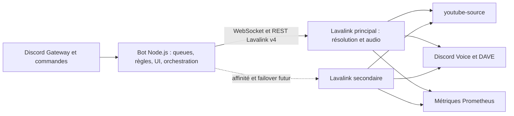

# Architecture Lavalink cible — étude uniquement

Statut : décision d'architecture, aucune implantation.
Référence vérifiée le 18 juillet 2026 : Lavalink `4.2.2`, plugin `youtube-source` `1.18.1`.

## Décision

Lavalink devient à terme le plan audio du bot tandis que le processus Node.js reste le plan de contrôle. À la charge actuelle — quatre guildes et au plus deux lectures simultanées — un seul nœud Lavalink suffit. Un second nœud n'est justifié que par la haute disponibilité ou par les seuils de capacité décrits plus bas.

Aucun composant Lavalink n'est implanté par ce document : pas de client, d'image, de configuration, de secret ni de déploiement. K3S reste hors périmètre et relève de son chantier dédié.

## Responsabilités

Le bot Node.js reste l'unique autorité pour :

- les commandes, permissions, réponses et composants Discord ;
- la queue logique, la répétition, les votes et les paramètres de guilde ;
- l'identité neutre des pistes (`provider`, `sourceId`, URL canonique) ;
- le choix du nœud, l'affinité d'une guilde et l'orchestration du failover ;
- la télémétrie utilisateur et la décision de reprise ou d'abandon.

Lavalink prend en charge :

- la résolution des sources et le chargement du flux via `youtube-source` ;
- le buffering, le décodage, les filtres compatibles et l'encodage Opus ;
- la connexion vocale Discord, y compris DAVE/E2EE avec une version compatible ;
- les événements de player, l'état de session et les métriques audio.

Les queues ne doivent jamais être répliquées implicitement depuis les players Lavalink. Un player est une projection de l'état Node ; si un nœud disparaît, Node conserve la piste courante, la position connue et les pistes suivantes.

## Flux d'une lecture

1. Node valide la commande, la guilde et le salon vocal.
2. Le fournisseur YouTube produit un identifiant canonique. La YouTube Data API n'est pas requise sur le chemin critique.
3. Node sélectionne le nœud affecté à la guilde et lui demande de charger la piste.
4. Après succès du chargement, Node crée ou met à jour le player avec les informations vocales Discord.
5. La lecture n'est annoncée comme démarrée qu'après l'événement de player attendu.
6. Les événements de fin, erreur ou websocket sont corrélés à la génération de session de la guilde avant toute mutation de queue.

## Sources et versions

- Épingler Lavalink `4.2.2` et `youtube-source` `1.18.1` dans la première expérimentation, avec validation explicite de leur compatibilité et de DAVE avant promotion.
- Désactiver la source YouTube intégrée de Lavalink lorsque `youtube-source` est actif afin d'éviter deux résolveurs concurrents.
- Les secrets ou jetons éventuellement requis par les clients YouTube ne transitent ni dans la queue ni dans les logs.
- SoundCloud pourra être ajouté comme autre implémentation de `MediaProvider`. Son ajout ne change ni les identifiants internes de queue ni la stratégie d'affinité.
- Les catalogues qui ne fournissent que des métadonnées ne doivent jamais être présentés comme des sources audio directes.

## Affinité, capacité et failover

Une guilde conserve son nœud pendant toute sa session vocale. Le choix initial utilise un rendezvous hashing pondéré sur `guildId` : le score stable est pénalisé par le nombre de players, la charge système Lavalink, les frames perdues/déficientes et l'état de drainage. Cela évite les migrations en cascade à chaque variation de charge.

Déclarer un nœud non éligible lorsqu'il ne répond plus au heartbeat ou dépasse durablement les limites de pertes de frames. Ne pas migrer un player simplement pour équilibrer quelques points de CPU.

Seuils de décision proposés, observés pendant au moins 15 minutes :

- avertissement à 65 % CPU ou 70 % de mémoire ;
- retrait des nouvelles affectations à 80 % CPU, 85 % de mémoire ou plus de 1 % de frames déficientes ;
- ajout d'un second nœud si le seuil d'avertissement est dépassé aux heures normales, si le p95 de démarrage excède 5 secondes, ou si la disponibilité impose la redondance.

La reprise de session Lavalink est configurée conceptuellement sur 60 secondes. En cas de rupture :

1. Node gèle les mutations venant de l'ancienne génération et tente la reprise de session sur le même nœud.
2. Si la fenêtre expire, il choisit un nœud sain, recrée le player et reprend à la dernière position confirmée.
3. Pour un live ou une source non repositionnable, la reprise repart du direct et le message utilisateur l'indique.
4. Un nœud en maintenance est drainé entre deux pistes ; une migration en cours de piste reste une procédure de dernier recours.

## Gapless et crossfade

Lavalink standard n'offre pas de crossfade natif et atomique entre deux players. Enchaîner deux commandes `play` avec des filtres de volume ne garantit ni mixage commun ni absence de trou réseau.

La migration doit donc conserver la cible gapless : pré-résoudre la piste suivante, déclencher sa lecture dès l'événement de fin et mesurer le silence. Un véritable crossfade demanderait un mixer ou plugin audio côté serveur, avec deux sources simultanées et une horloge partagée ; ce serait un projet séparé avec benchmarks CPU et tests perceptifs.

## Observabilité et objectifs

Node expose ou journalise avec `guildId` haché, `nodeId` et génération de session :

- latence commande → piste chargée → player actif ;
- erreurs de résolution par fournisseur et motif ;
- tentatives de reprise, failovers et positions reprises ;
- nombre de queues, players et commandes en attente par nœud.

Les métriques Lavalink à collecter comprennent CPU, mémoire, uptime, players actifs, players en lecture, frames envoyées, déficientes et perdues. Les mots de passe, tokens Discord, paramètres d'authentification YouTube et URL signées sont systématiquement masqués.

Objectifs du pilote : démarrage p95 inférieur à 5 secondes avec nouvelle connexion, moins de 1 % d'échecs non expliqués, reprise récupérable en moins de 15 secondes et absence de contamination entre guildes.

## Migration et retour arrière

1. Introduire ultérieurement un adaptateur audio derrière l'interface actuelle, sans changer les commandes ni le format de queue.
2. Déployer un seul nœud Lavalink isolé et tester recherche, URL, playlist, seek, pause, skip, DAVE et déconnexion.
3. Activer par liste de guildes : une guilde interne, puis les deux lectures simultanées actuelles, puis 10 % et 50 % des guildes.
4. Comparer les SLO au pipeline local pendant au moins 24 heures par palier.
5. En cas de dépassement, arrêter les nouvelles sessions Lavalink et laisser les sessions s'achever ; les nouvelles queues reviennent au pipeline local.

Le rollback ne convertit pas un player en cours de lecture. Node garde assez d'état pour recréer la piste sur le pipeline local à la dernière position confirmée, avec au plus une interruption explicitement signalée.

## Points à valider lors du futur chantier

- bibliothèque cliente Node Lavalink v4 maintenue et compatible avec les événements nécessaires ;
- matrice exacte Lavalink/Java/`youtube-source`/DAVE ;
- stockage des secrets et politique de rotation ;
- capacité réelle par nœud obtenue par test de charge audio, pas par extrapolation ;
- conditions d'utilisation et restrictions propres à chaque fournisseur.

Références officielles : [Lavalink](https://github.com/lavalink-devs/Lavalink), [youtube-source](https://github.com/lavalink-devs/youtube-source), [Discord Voice Connections](https://docs.discord.com/developers/topics/voice-connections).
